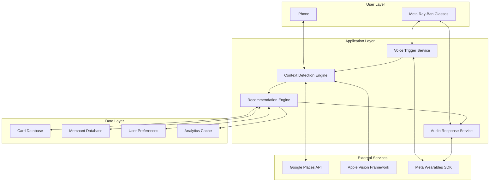

# CardMax: Technical Architecture Document
**Version:** 2.0.0
**Date:** April 2026
**Status:** MVP Development — Core Loop Complete

---

## 1. System Architecture Overview

### High-Level Architecture



---

## 2. Core Components

### 2.1 Siri App Intents (Voice Activation)

**Purpose:** Zero-battery voice activation via system Siri integration

The previous `VoiceTriggerService` (continuous `SFSpeechRecognizer` listening) was removed due to OOM crashes from persistent audio engine taps and recursive restart loops. CardMax now uses Apple App Intents exclusively.

```swift
// Siri activation flow:
// 1. AppShortcutsProvider registers "Which card at $merchant" with Siri
// 2. User invokes via Siri voice command
// 3. App Intent calls CardMaxViewModel.recommendForMerchantName(_:) or recommendForCategory(_:)
// 4. RecommendationEngine finds optimal card across all household owners
// 5. AudioResponseService speaks result through glasses via AVSpeechSynthesizer
```

**Key advantage:** Zero battery impact when idle. Siri handles all voice recognition, wake word detection, and natural language parsing.

### 2.2 Context Detection Engine

**Purpose:** Determines merchant through visual recognition or location

```swift
// ContextDetectionEngine.swift
class ContextDetectionEngine {
    private let visualDetector = VisualMerchantDetector()
    private let locationDetector = LocationMerchantDetector()

    enum DetectionResult {
        case merchant(Merchant, confidence: Float)
        case category(MerchantCategory)
        case unknown
    }

    func detectCurrentContext() async -> DetectionResult {
        // Parallel detection
        async let visualResult = visualDetector.detect()
        async let locationResult = locationDetector.detect()

        // Visual takes priority (works for online shopping)
        if let visual = await visualResult,
           visual.confidence > 0.7 {
            return .merchant(visual.merchant, confidence: visual.confidence)
        }

        // Fall back to location
        if let location = await locationResult,
           location.confidence > 0.6 {
            return .merchant(location.merchant, confidence: location.confidence)
        }

        // Ask user for category
        return .unknown
    }
}

// Visual Detection Component
class VisualMerchantDetector {
    private let visionService = VisionService()

    func detect() async -> (merchant: Merchant, confidence: Float)? {
        // Capture frame from Meta glasses
        guard let frame = await MetaGlassesService.shared.captureFrame() else {
            return nil
        }

        // Parallel processing
        async let logoDetection = detectLogo(in: frame)
        async let textDetection = detectText(in: frame)
        async let urlDetection = detectURL(in: frame)

        // Combine results
        let results = await [logoDetection, textDetection, urlDetection].compactMap { $0 }
        return results.max(by: { $0.confidence < $1.confidence })
    }

    private func detectLogo(in frame: CIImage) async -> (Merchant, Float)? {
        // Use Core ML model for logo detection
        // Pre-trained on top 100 merchant logos
    }

    private func detectText(in frame: CIImage) async -> (Merchant, Float)? {
        // OCR for merchant names
        let request = VNRecognizeTextRequest()
        request.recognitionLevel = .accurate

        // Process and match against merchant database
    }
}
```

### 2.3 Recommendation Engine

**Purpose:** Calculates optimal card based on merchant and user's card portfolio

```swift
// RecommendationEngine.swift
class RecommendationEngine {
    struct Recommendation {
        let card: CreditCard
        let reason: String
        let rewardRate: Float
        let estimatedValue: Decimal?
        let confidence: Float
    }

    func recommendCard(
        for merchant: Merchant,
        userCards: [CreditCard],
        amount: Decimal? = nil
    ) -> Recommendation {
        // Get merchant category
        let category = merchant.primaryCategory

        // Calculate rewards for each card
        let cardRewards = userCards.map { card in
            let rate = calculateRewardRate(
                card: card,
                merchant: merchant,
                category: category
            )
            return (card: card, rate: rate)
        }

        // Find best card
        guard let best = cardRewards.max(by: { $0.rate < $1.rate }) else {
            return defaultRecommendation()
        }

        // Generate natural language explanation
        let reason = generateReason(
            card: best.card,
            rate: best.rate,
            merchant: merchant
        )

        return Recommendation(
            card: best.card,
            reason: reason,
            rewardRate: best.rate,
            estimatedValue: amount.map { $0 * Decimal(best.rate) / 100 },
            confidence: 0.95
        )
    }

    private func calculateRewardRate(
        card: CreditCard,
        merchant: Merchant,
        category: MerchantCategory
    ) -> Float {
        // Check for merchant-specific bonuses
        if let merchantBonus = card.merchantBonuses[merchant.id] {
            return merchantBonus
        }

        // Check category rewards
        if let categoryRate = card.categoryRewards[category] {
            return categoryRate
        }

        // Check rotating categories (e.g., Chase Freedom)
        if let rotatingRate = checkRotatingCategory(card: card, category: category) {
            return rotatingRate
        }

        // Default cash back rate
        return card.defaultRate
    }
}
```

### 2.4 Audio Response Service

**Purpose:** Converts recommendations to natural speech via Meta glasses or phone speaker

```swift
// AudioResponseService.swift
@MainActor
class AudioResponseService: NSObject, ObservableObject {
    private let synthesizer = AVSpeechSynthesizer()

    // Selects the highest quality en-US voice available on the device
    private lazy var preferredVoice: AVSpeechSynthesisVoice? = {
        AVSpeechSynthesisVoice.speechVoices()
            .filter { $0.language.hasPrefix("en-US") }
            .sorted { $0.quality.rawValue > $1.quality.rawValue }
            .first
    }()

    // Audio session configured for .playAndRecord with .allowBluetooth + .defaultToSpeaker
    // Routes through glasses when connected, falls back to phone speaker

    func speakRecommendation(card:, merchant:, rewardRate:, category:, completion:)
    // Generates: "Use your Amex Gold, 4% back on dining."
    // Owner prefix added when card.owner != "Me": "Sarah's Blue Cash Preferred, 6% back..."
}
```

---

## 3. Data Models

### 3.1 Core Entities

```swift
// Models/CreditCard.swift
struct CreditCard: Codable, Identifiable, Hashable {
    let id: UUID
    let nickname: String              // "Sapphire"
    let fullName: String              // "Chase Sapphire Preferred"
    let issuer: CardIssuer            // .chase
    let network: CardNetwork          // .visa
    let lastFourDigits: String

    // Reward Structure
    let defaultRate: Float            // 1.0 for 1%
    let categoryRewards: [MerchantCategory: Float]
    let merchantBonuses: [String: Float]  // Merchant ID -> bonus rate
    let rotatingCategories: [RotatingSchedule]

    // Ownership
    let owner: String                 // "Me", spouse name, etc.

    // Metadata
    let annualFee: Decimal
    let addedDate: Date
    let isActive: Bool
    let color: CardColor              // PO-inspired muted palette

    // Computed: merges static categoryRewards with active rotating schedule
    var effectiveCategoryRewards: [MerchantCategory: Float]
    var activeRotatingCategories: (categories: [MerchantCategory], rate: Float)?
}

// Rotating quarterly category schedules (e.g., Discover it Q2 2026: gas + transportation at 5%)
struct RotatingSchedule: Codable, Hashable {
    let quarter: Int                  // 1-4
    let year: Int                     // 2026
    let categories: [MerchantCategory]
    let rate: Float                   // typically 5.0
}

// Models/Receipt.swift
struct Receipt: Codable, Identifiable {
    let id: UUID
    let imageFileName: String         // JPEG saved to Documents/receipts/
    let capturedAt: Date
    var image: UIImage?               // Loaded from disk on access
}

// Card catalog: 15+ preset cards from Chase, Amex, Citi, Capital One, Discover, BofA, Wells Fargo
// Users add from catalog via AddCardView (searchable, grouped by issuer)
```

### 3.2 Persistence

CardMax uses **JSON file persistence** (not CoreData) for simplicity:

```swift
// CardStorageService — saves/loads [CreditCard] as JSON to Documents directory
// ReceiptStorageService — saves/loads [Receipt] metadata as JSON, images as JPEG files

// Card portfolio persists via @Published var userCards didSet observer in CardMaxViewModel
// Receipt list persists on add/delete operations
```

---

## 4. Service Integration

### 4.1 Meta Wearables SDK Integration

```swift
// Services/MetaGlassesService.swift
class MetaGlassesService: ObservableObject {
    static let shared = MetaGlassesService()

    @Published var isConnected = false
    @Published var batteryLevel: Float = 100

    private var streamSession: StreamSession?
    private var audioSession: AudioSession?

    func initialize() {
        // Configure Meta SDK
        Wearables.configure()

        // Set up stream session for POV capture
        let config = StreamSessionConfig(
            videoCodec: .raw,
            resolution: .low,      // Balance quality vs speed
            frameRate: 1          // Single frame capture
        )

        streamSession = StreamSession(
            streamSessionConfig: config,
            deviceSelector: AutoDeviceSelector(wearables: Wearables.shared)
        )
    }

    func captureFrame() async -> CIImage? {
        // Capture single frame from glasses
        guard let session = streamSession else { return nil }

        return await withCheckedContinuation { continuation in
            let token = session.videoFramePublisher.listen { frame in
                let ciImage = CIImage(cvPixelBuffer: frame.pixelBuffer)
                continuation.resume(returning: ciImage)
            }

            // Clean up listener
            DispatchQueue.main.asyncAfter(deadline: .now() + 0.1) {
                token.cancel()
            }
        }
    }
}
```

### 4.2 Google Places API Integration

```swift
// Services/PlacesService.swift
class PlacesService {
    private let apiKey = Config.googlePlacesAPIKey
    private let session = URLSession.shared

    struct PlaceResult {
        let name: String
        let placeId: String
        let types: [String]
        let confidence: Float
    }

    func findNearbyMerchant(
        location: CLLocation,
        radius: Int = 50
    ) async throws -> PlaceResult? {
        let url = buildNearbySearchURL(
            location: location,
            radius: radius
        )

        let (data, _) = try await session.data(from: url)
        let response = try JSONDecoder().decode(PlacesResponse.self, from: data)

        guard let place = response.results.first else {
            return nil
        }

        return PlaceResult(
            name: place.name,
            placeId: place.placeId,
            types: place.types,
            confidence: calculateConfidence(place)
        )
    }
}
```

---

## 5. Performance Optimization

### 5.1 Battery Optimization

```swift
// Strategies to minimize battery drain:

1. Voice Trigger Optimization
   - Use low-power wake word detection
   - Process audio on-device only
   - Suspend when glasses not worn

2. Location Services
   - Only activate on voice trigger
   - Use significant location changes
   - Cache recent locations

3. Visual Processing
   - Single frame capture (not video)
   - Downscale images before processing
   - Use efficient Core ML models

4. Network Requests
   - Batch API calls
   - Cache merchant data locally
   - Prefetch for frequent locations
```

### 5.2 Response Time Optimization

```swift
// Target: <2 seconds from trigger to response

1. Parallel Processing
   - Visual and location detection simultaneously
   - Preload ML models at app launch
   - Warm up audio engine

2. Smart Caching
   - Cache last 100 merchants
   - Store user's frequent locations
   - Precompute card recommendations

3. Progressive Response
   - Immediate: "Checking..."
   - 1 second: "At Starbucks..."
   - 2 seconds: "Use Chase Sapphire"
```

---

## 6. Security & Privacy

### 6.1 Data Protection

```swift
// Security measures:

1. Card Information
   - Store in iOS Keychain
   - Never store full card numbers
   - Encrypt rewards data

2. Visual Data
   - Process on-device only
   - Immediately discard frames
   - No cloud uploads

3. Location Data
   - Only access when triggered
   - Don't store location history
   - User can disable per-merchant

4. Network Security
   - Certificate pinning for APIs
   - No sensitive data in logs
   - Obfuscate API keys
```

### 6.2 Privacy Compliance

```
- GDPR: All data processing is local
- CCPA: No data sale or sharing
- App Store: Request minimal permissions
- User Control: Clear data deletion option
```

---

## 7. Testing Strategy

### 7.1 Unit Testing

```swift
// Test coverage targets:
- Models: 100%
- Business Logic: 95%
- UI: 80%

// Example test:
func testRecommendationEngine() {
    let engine = RecommendationEngine()
    let cards = [TestData.chaseCard, TestData.amexCard]
    let merchant = TestData.wholeFoodsMerchant

    let recommendation = engine.recommendCard(
        for: merchant,
        userCards: cards
    )

    XCTAssertEqual(recommendation.card.id, TestData.amexCard.id)
    XCTAssertEqual(recommendation.rewardRate, 4.0)
}
```

### 7.2 Integration Testing

```
1. Voice Trigger → Detection → Recommendation
2. Online merchant detection accuracy
3. Offline location detection accuracy
4. Meta glasses connectivity
5. Audio response delivery
```

### 7.3 Performance Testing

```
- Voice recognition: <500ms
- Visual detection: <1000ms
- Location detection: <1500ms
- Total response: <2000ms
- Battery impact: <5% per day
```

---

## 8. Deployment Architecture

### 8.1 CI/CD Pipeline

```yaml
# .github/workflows/ios.yml
name: iOS CI/CD

on:
  push:
    branches: [main, develop]
  pull_request:
    branches: [main]

jobs:
  test:
    runs-on: macos-latest
    steps:
      - uses: actions/checkout@v2
      - name: Run tests
        run: |
          xcodebuild test \
            -scheme CardMax \
            -sdk iphonesimulator \
            -destination 'platform=iOS Simulator,name=iPhone 14'

  deploy:
    if: github.ref == 'refs/heads/main'
    runs-on: macos-latest
    steps:
      - name: Deploy to TestFlight
        run: |
          fastlane beta
```

### 8.2 Analytics & Monitoring

```swift
// Key metrics to track:

1. User Engagement
   - Daily active users
   - Queries per user
   - Feature adoption

2. System Performance
   - Detection accuracy
   - Response times
   - Error rates

3. Business Metrics
   - Cards added per user
   - Recommendations followed
   - Estimated savings

// Implementation:
Firebase.Analytics.logEvent("recommendation_given", parameters: [
    "merchant": merchant.name,
    "card": card.nickname,
    "confidence": confidence
])
```

---

## 9. Scalability Considerations

### Future Scale Requirements
- 100K+ daily active users
- 1M+ queries per day
- 500+ supported merchants
- 50+ card types

### Architecture Evolution
1. **Month 1-3:** Local processing only
2. **Month 4-6:** Add CloudKit sync
3. **Month 7-12:** ML model updates via CloudKit
4. **Year 2:** Server-side processing option

---

## 10. Technology Decisions Log

| Decision | Rationale | Alternative Considered | Date |
|----------|-----------|----------------------|------|
| SwiftUI only | Faster development, modern | UIKit | March 2024 |
| JSON persistence | Simple, no migration overhead | CoreData | April 2026 |
| Google Places | Better merchant categorization | Apple Maps | March 2024 |
| On-device ML | Privacy, speed | Cloud ML | March 2024 |
| Siri App Intents | Zero battery, no OOM crashes | In-app SFSpeechRecognizer | April 2026 |
| Hardcoded rotating schedules | Simple, no server needed | Remote config | April 2026 |
| Multi-owner via owner field | Simple household support | Separate user profiles | April 2026 |

---

*Last Updated: April 2026*
*Next Review: Post-MVP Launch*