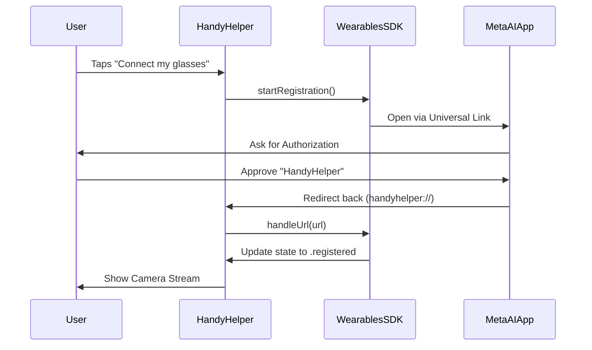
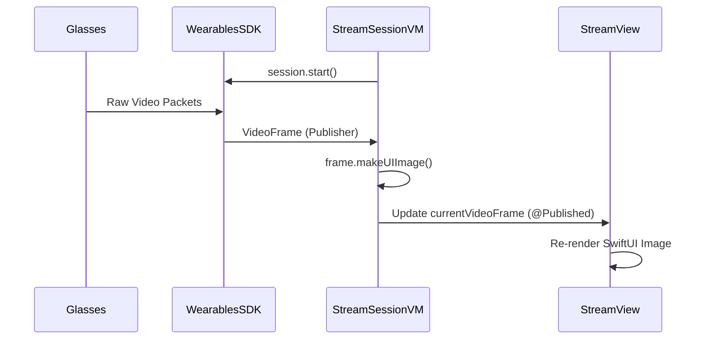

# HandyHelper Technical Documentation
*Meta Ray-Ban Wearables Integration Architecture*

## 1. High-Level Architecture
HandyHelper is built on the Meta Wearables Device Access Toolkit (DAT) SDK. It follows an **MVVM (Model-View-ViewModel)** pattern where the SDK provides the Model layer for hardware interaction.

### Core Frameworks:
- **MWDATCore**: Manages device identity, discovery, and registration (OAuth).
- **MWDATCamera**: Handles high-performance media streaming and photo capture.
- **MWDATMockDevice**: Provides simulation capabilities for development without physical hardware.

---

## 2. Key Classes & Responsibilities

### A. App Layer (`HandyHelperApp.swift`)
The entry point of the application.
- **`Wearables.configure()`**: Crucial initialization call that prepares the SDK.
- **`Wearables.shared`**: Singleton providing access to the `WearablesInterface`.

### B. ViewModels (The "Brain")
- **`WearablesViewModel`**: 
  - Tracks the global state of the wearable system.
  - Monitors `registrationState` (.registered, .registering, .unregistered).
  - Maintains a list of available `devices`.
  - Handles the triggers for starting and stopping the Meta AI registration handshake.
- **`StreamSessionViewModel`**:
  - Manages the lifecycle of a specific camera session.
  - Converts raw SDK `VideoFrame` data into `UIImage` for SwiftUI display.
  - Handles photo capture logic and error formatting.

### C. Views (The "Body")
- **`MainAppView`**: Acts as a state-driven router. If not registered, shows `HomeScreenView`; if registered, shows `StreamSessionView`.
- **`RegistrationView`**: An invisible background view that listens for deep links (`handyhelper://`) via `.onOpenURL` to complete the OAuth handshake.
- **`StreamView`**: Renders the live POV feed using standard SwiftUI `Image` components updated at 24fps.

---

## 3. Interaction Flows

### Flow 1: The Meta AI Handshake (Registration)
This swimlane illustrates how the app gains permission to access the glasses' private data (camera/mic).



### Flow 2: Live POV Streaming
Once registered, this flow details how frames move from the glasses to the phone screen.



---

## 4. Service Logic Detail

### The Device Selector (`AutoDeviceSelector`)
The app uses an `AutoDeviceSelector` which abstracts away the complexity of choosing which glasses to use if multiple are paired. It automatically picks the "active" wearable (the one on the user's head).

### The Listener Pattern
The SDK does not use standard Delegates for most real-time data. Instead, it uses **Listener Tokens**:
```swift
videoFrameListenerToken = streamSession.videoFramePublisher.listen { frame in
    // Real-time frame processing
}
```
This allows multiple parts of the app to "tap" into the camera feed (e.g., one for UI display, one for our future Furniture Vision Service).

---

## 5. Security & Privacy
- **OAuth 2.0**: The registration flow ensures HandyHelper never sees the user's Meta credentials.
- **Encryption**: The video stream is encrypted end-to-end between the glasses and the phone.
- **Privacy Keys**: The app strictly adheres to iOS privacy requirements via `NSCameraUsageDescription` and `NSBluetoothAlwaysUsageDescription`.
