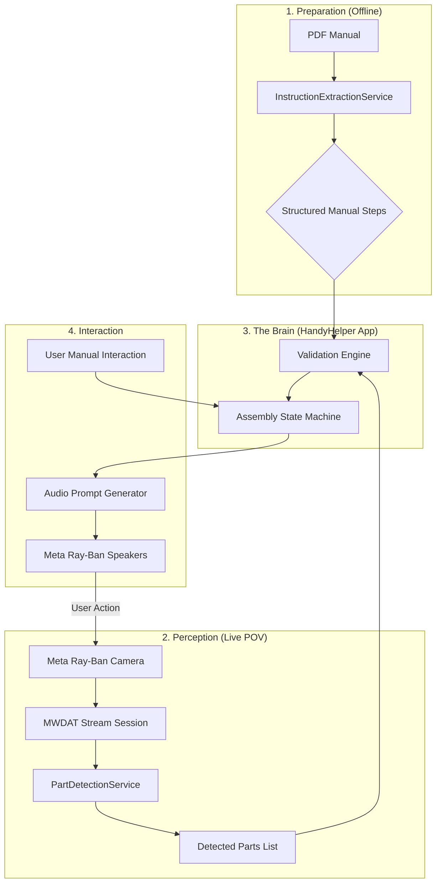

# HandyHelper: Business & Technical Specification
**Project:** Meta Ray-Ban Powered AR Furniture Assembly Assistant  
**Architect:** Staff Engineering Team  
**Status:** MVP Implementation (Phase 2)

## 1. Business Context & Value Proposition

### The Problem
Furniture assembly (e.g., IKEA) represents a high-friction user experience characterized by **cognitive overload**. Users must constantly switch their attention between:
1.  **The 2D Manual**: Abstract diagrams and part numbers.
2.  **The 3D Workspace**: A chaotic pile of wood, screws, and tools.
3.  **The Physical Task**: Managing tools with both hands.

### The Solution: The "Audio-First" AR Assistant
HandyHelper leverages the Meta Ray-Ban Smart Glasses to create a hands-free, proactive guidance loop. Unlike traditional AR (which requires holding a phone or wearing heavy headsets), HandyHelper uses **POV Vision** and **Open-Ear Audio** to provide a "Expert over your shoulder" experience.

**Key Value Drivers:**
*   **Reduced Error Rate**: The app confirms if the user is holding the correct part *before* they attach it.
*   **True Hands-Free**: Voice commands and automatic visual triggers remove the need to touch a phone or flip physical pages.
*   **Contextual Awareness**: The app doesn't just read the manual; it "understands" the state of the physical assembly.

---

## 2. Technical Pipeline Architecture

The system operates on a "Dual-Stream" architecture: one stream processes the **Static Manual** (The Source of Truth), and the other processes **Live Reality** (The POV Stream).

### A. The Perception Pipeline (Real-Time)
1.  **Ingestion**: Meta Glasses stream raw video packets via the `MWDATCamera` framework at 24fps.
2.  **Part Detection (Vision/CoreML)**: A pipeline using `VNRecognizeTextRequest` and `VNDetectRectanglesRequest` (with future support for YOLOv8) scans the frame for specific IKEA hardware.
3.  **Spatial Filtering**: The system filters detections to focus on objects central to the field of view.

### B. The Reasoning Engine (The Bridge)
1.  **PDF Structured Mapping**: The PDF manual is pre-processed using the `InstructionExtractionService` which converts diagrams and pages into a "Step Requirement List".
2.  **State Validation**: The engine in `AssemblySessionView` compares the "Detected Parts" against the "Current Step Requirements."
3.  **Trigger Mechanism**: When a match is detected (e.g., User picks up the correct panel), the state machine advances.

### C. The Interaction Layer (Audio Feedback)
1.  **TTS Synthesis**: Using `AVSpeechSynthesizer` via the Bluetooth HFP profile.
2.  **Low-Latency Cues**: Proactive whispers like *"I see you found the top panel. Place it face down now."*

---

## 3. Data Flow Diagram

---

## 4. Technical Stack Detail

| Component | Technology | Rationale |
| :--- | :--- | :--- |
| **Connectivity** | Meta MWDAT SDK | Official access to Ray-Ban hardware. |
| **Vision (Local)** | CoreML + Vision | Optimized for Apple Neural Engine (ANE) to maintain 24fps. |
| **PDF Handling**| PDFKit | Standard iOS library for high-fidelity manual rendering. |
| **UI Framework** | SwiftUI | Rapid state-driven UI development. |
| **Audio Routing** | AVFoundation | Standardized handling of Bluetooth HFP/A2DP profiles. |
