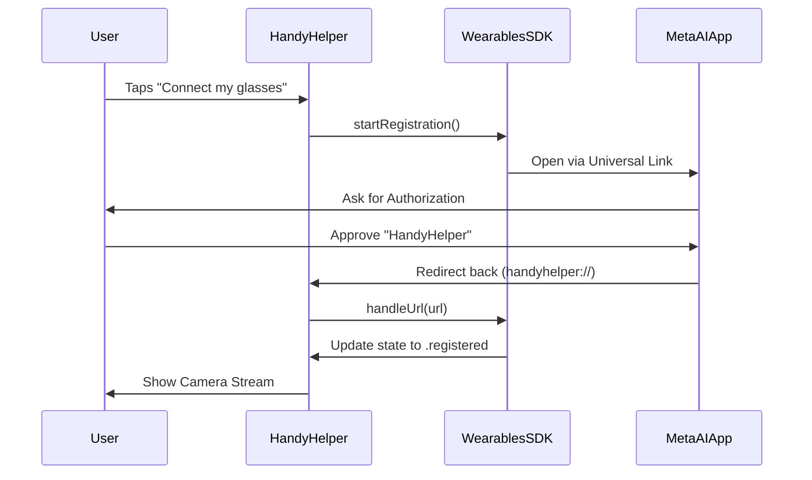
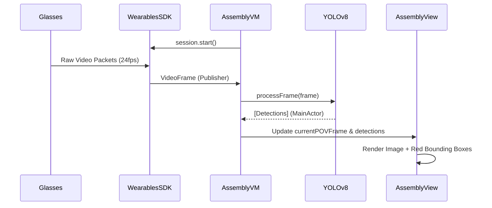

# HandyHelper Technical Documentation
*Meta Ray-Ban Wearables Integration Architecture*

## 1. High-Level Architecture
HandyHelper is built on the Meta Wearables Device Access Toolkit (DAT) SDK. It follows an **MVVM (Model-View-ViewModel)** pattern where the SDK provides the Model layer for hardware interaction.

### Core Frameworks:
- **MWDATCore**: Manages device identity, discovery, and registration (OAuth).
- **MWDATCamera**: Handles high-performance media streaming and photo capture.
- **CoreML & Vision**: Powers the SOTA "Dual Pipeline" (Donut for documents, YOLOv8 for real-time tracking).

---

## 2. Key Classes & Responsibilities

### A. App Layer (`HandyHelperApp.swift`)
The entry point of the application.
- **`Wearables.configure()`**: Crucial initialization call that prepares the SDK.
- **`Wearables.shared`**: Singleton providing access to the `WearablesInterface`.

### B. ViewModels (The "Brain")
- **`WearablesViewModel`**: 
  - Tracks the global state of the wearable system.
  - Monitors `registrationState` (.registered, .registering, .unregistered).
- **`AssemblyViewModel`**:
  - Manages the lifecycle of a specific manual assembly session.
  - Subscribes to the live 24fps camera feed via `activeDeviceStream`.
  - Coordinates the state machine (moving between steps) based on inputs from the `PartDetectionService`.
- **`ManualDetailViewModel`**:
  - Handles the offline pre-processing of PDFs using `InstructionExtractionService`.

### C. Services (The ML Pipeline)
- **`LocalDocumentTransformer`**: Loads an `.mlpackage` (Donut) to intelligently extract JSON steps from visual IKEA manual diagrams without cloud APIs.
- **`PartDetectionService`**: Dynamically loads a YOLOv8 CoreML model to detect objects in the 24fps POV stream. Falls back to Apple Vision OCR if the model is missing. Safely dispatches all results to the `MainActor`.

### D. Views (The "Body")
- **`ManualHubView`**: The unified starting point. Shows the library of manuals and dynamically updates UI based on glasses connectivity.
- **`AssemblySessionView`**: The core AR Copilot interface. Features a dynamic layout picker (Split, POV, Manual) allowing the user to dedicate screen real estate to the live camera feed (with YOLO bounding boxes) or the PDF diagram.

---

## 3. Interaction Flows

### Flow 1: The Meta AI Handshake (Registration)
This swimlane illustrates how the app gains permission to access the glasses' private data (camera/mic).



### Flow 2: Live POV Streaming & SOTA Object Detection
Once registered, this flow details how frames move from the glasses to the YOLOv8 model.



---

## 4. Service Logic Detail

### The Device Selector (`AutoDeviceSelector`)
The app uses an `AutoDeviceSelector` which abstracts away the complexity of choosing which glasses to use if multiple are paired. It automatically picks the "active" wearable (the one on the user's head).

### The Listener Pattern
The SDK does not use standard Delegates for most real-time data. Instead, it uses **Listener Tokens**:
```swift
videoFrameListenerToken = streamSession.videoFramePublisher.listen { frame in
    // Real-time frame processing
}
```
This allows multiple parts of the app to "tap" into the camera feed (e.g., one for UI display, one for our YOLOv8 Vision Service).

---

## 5. Security & Privacy
- **OAuth 2.0**: The registration flow ensures HandyHelper never sees the user's Meta credentials.
- **Encryption**: The video stream is encrypted end-to-end between the glasses and the phone.
- **Local Inference**: The Donut document extraction and YOLOv8 part detection run 100% locally on the device's Neural Engine. No images are sent to the cloud, ensuring maximum user privacy.
