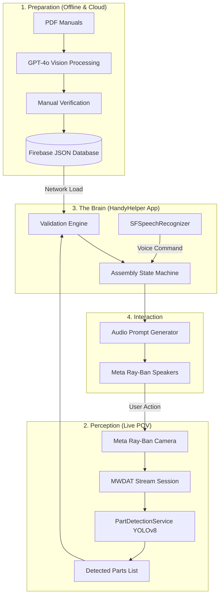

# Initial Concept
# HandyHelper: Business & Technical Specification
**Project:** Meta Ray-Ban Powered AR Furniture Assembly Assistant  
**Architect:** Staff Engineering Team  
**Status:** MVP Implementation (Phase 4 - Production Scope & Custom ML)

## 1. Business Context & Value Proposition

### The Problem
Furniture assembly (e.g., IKEA) represents a high-friction user experience characterized by **cognitive overload**. Users must constantly switch their attention between:
1.  **The 2D Manual**: Abstract diagrams and part numbers.
2.  **The 3D Workspace**: A chaotic pile of wood, screws, and tools.
3.  **The Physical Task**: Managing tools with both hands.

### The Solution: The "Audio-First" AR Assistant
HandyHelper leverages the Meta Ray-Ban Smart Glasses to create a hands-free, proactive guidance loop. Unlike traditional AR (which requires holding a phone or wearing heavy headsets), HandyHelper uses **POV Vision** and **Open-Ear Audio** to provide an "Expert over your shoulder" experience.

**Key Value Drivers:**
*   **Reduced Error Rate**: The app confirms if the user is holding the correct part *before* they attach it.
*   **True Hands-Free**: Voice commands ("Next step", "Go back") and automatic visual triggers remove the need to touch a phone or flip physical pages.
*   **Contextual Awareness**: The app doesn't just read the manual; it "understands" the state of the physical assembly.

---

## 2. Production Scope: The "Top 10" Vertical Slice

To guarantee a reliable, production-ready release without spending thousands of dollars on massive AI models, the MVP scope is strictly limited to the **10 most popular, complex IKEA products** (e.g., MALM Bed, PAX Wardrobe, HEMNES Dresser). 

This vertical slice allows us to deliver a 100% accurate experience.

## 3. Technical Pipeline Architecture

The system operates on a "Dual-Stream" architecture: one stream processes the **Static Manual** (The Source of Truth), and the other processes **Live Reality** (The POV Stream).

### A. The Brain: Manual Ingestion (Offline Pipeline)
1.  **GPT-4o Vision Extraction**: Because standard OCR and lightweight on-device models fail to understand complex 2D diagrams and arrows, we extract the 10 manuals *offline* using OpenAI's GPT-4o Vision API.
2.  **Firebase JSON Hosting**: The generated `AssemblyStep` JSON arrays are manually verified for 100% accuracy and hosted on a free Firebase database. 
3.  **Zero-Latency Delivery**: The iOS app downloads these perfect JSON files instantly, eliminating on-device processing time, battery drain, and hallucination risks.

### B. The Eyes: Real-Time Perception (On-Device Pipeline)
1.  **Ingestion**: Meta Glasses stream raw video packets via the `MWDATCamera` framework at 24fps.
2.  **Part Detection (YOLOv8 via CoreML)**: A blazing-fast local object detection pipeline running on the Apple Neural Engine (ANE). 
3.  **Custom Training Dataset**: Rather than scraping or manually photographing parts, we leverage pre-existing, open-source IKEA part datasets from Roboflow Universe. This provides thousands of pre-labeled images of screws, dowels, and panels, allowing us to immediately train a custom YOLOv8 model on a cloud GPU and export the `.mlpackage`.

### C. The Interaction Layer (Audio Feedback)
1.  **TTS Synthesis**: Using `AVSpeechSynthesizer` via the Bluetooth HFP profile.
2.  **Voice Control**: Apple `SFSpeechRecognizer` actively listens for commands ("Next", "Repeat") to provide a fully hands-free loop.

---

## 4. Data Flow Diagram

---

## 5. Technical Stack Detail

| Component | Technology | Rationale |
| :--- | :--- | :--- |
| **Connectivity** | Meta MWDAT SDK | Official access to Ray-Ban hardware. |
| **Document Understanding** | GPT-4o (Offline) + Firebase | Guarantees 100% accurate instruction maps without iOS battery drain. |
| **Vision (Local)** | Custom YOLOv8 (CoreML) | Unmatched real-time object tracking latency at 24fps on the ANE. |
| **Dataset Generation** | `yt-dlp` + Roboflow | Rapid, free generation of real-world part data from YouTube. |
| **UI Framework** | SwiftUI | Rapid state-driven UI development. |
| **Audio Routing** | AVFoundation & SFSpeech | Handles TTS and Voice Commands via Bluetooth HFP profile. |
Project goal inferred from PRODUCT_SPEC.md: A hands-free, AI-powered AR assistant for furniture assembly using Meta Ray-Ban Smart Glasses.
